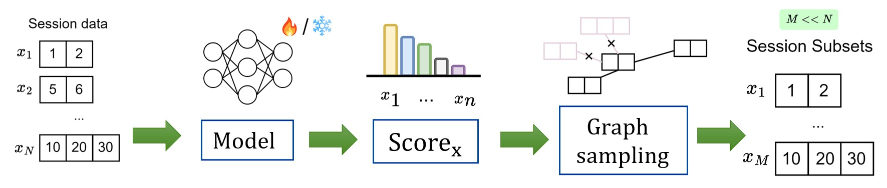
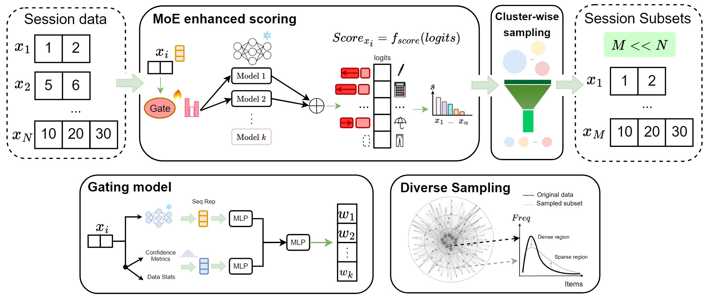
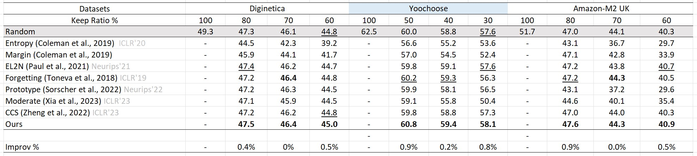
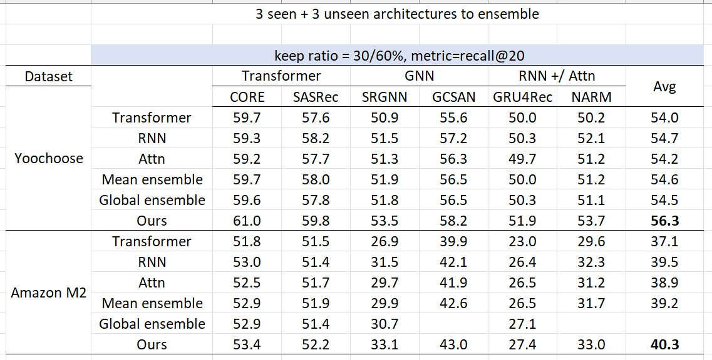
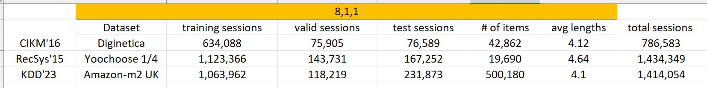

# dataPruning4Rec

In summary, multiple models is better than single model at judging the data quality, in which we use MoE to avoid such model bias issue. Besides, there have yet been data pruning works done in sequential recommendation setting.

Motivation:   
1. Single model has model bias e.g. RNN favours simple data patterns e.g. short interaction sequence while transformer is good at long complex sequence
2. MoE leverages the strength of different models
3. A healthy coverage on both easy and hard samples is important, and so we can use e.g. graph based sampling algorithm
   


<p align=center> Three stages in data pruning: model training, scoring and post sampling.</p>

</br>
</br>



<p align=center> Our pipeline in sampling divese high quality recommendation data.</p>

Steps:
1. Train base models (RNN, GNN, transformer, RNN + attention) with RecBole and record training dynamic e.g. training loss
2. (Baseline algorithms) Given training dynamics, get the average data importance score e.g. EL2N
3. Traing a gating model with the base models (MoE), tune parameters 1) k experts selected 2) coefficient for load balance loss (if without, then some expert will not be used at all, we want cross architecture generalizability i.e. take advantage of each model strength)
4. Apply data pruning algorithms e.g. CCS based on the score
5. Retrain base models on the selected data subset and record performance

```
get_importance_score.py
main.py
moe.py                      # moe architecture
run.py                      # experiments with different params
selection_mp.py             # data pruning algo
utils_seq.py                # process RecBole Dataset
utils_trainer.py            # record training dynamics 4 RecBole API
```



<p align=center> Main table. Compare to e.g. EL2N, ours does not needs to store the training dynamics.</p>


<p align=center> Ablation study compare single model vs ensemble vs ours.</p>


<p align=center> Dataset statistics.</p>

Reference:
- https://github.com/adymaharana/d2pruning
- Mixture of Link Predictors